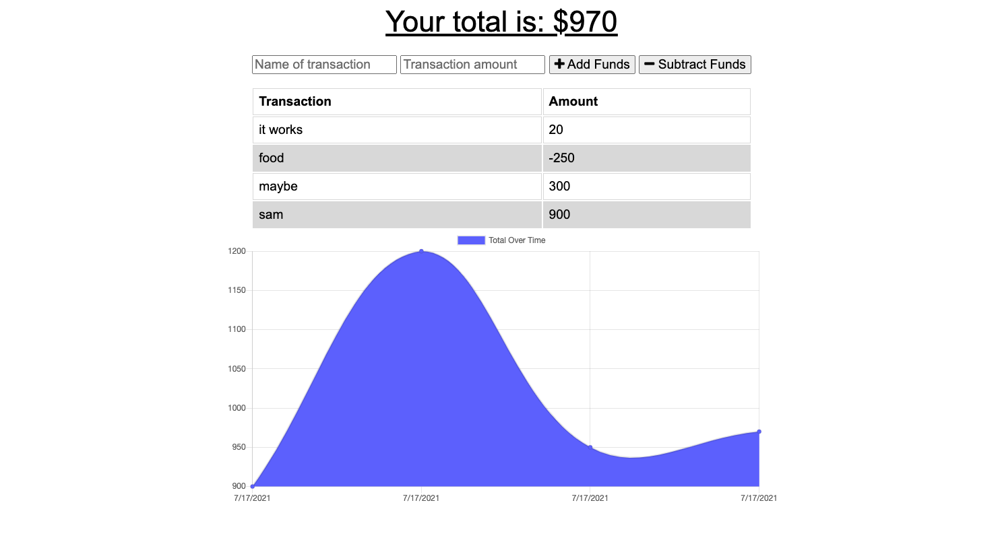

# budget-tracker

## Github Repo:
[Wsamuell](https://github.com/Wsamuell/budget-tracker)

## Deployed Link: 
[Budget-tracker](https://sams-budget-tracket.herokuapp.com/)

## ScreenShot: 

## Description 
This is a Budget tracker that keeps track of your spending while offline and online so you have a little more flexibility on having access to your budget

## Installation 
* Using npm i to install all required packages would be the first step for an app like this
* npm start runs the entire project

### User Story
* AS AN avid traveler
* I WANT to be able to track my withdrawals and deposits with or without a data/internet connection
* SO THAT my account balance is accurate when I am traveling 

### Acceptance Criteria
* GIVEN a budget tracker without an internet connection
* WHEN the user inputs an expense or deposit
* THEN they will receive a notification that they have added an expense or deposit
* WHEN the user reestablishes an internet connection
* THEN the deposits or expenses added while they were offline are added 